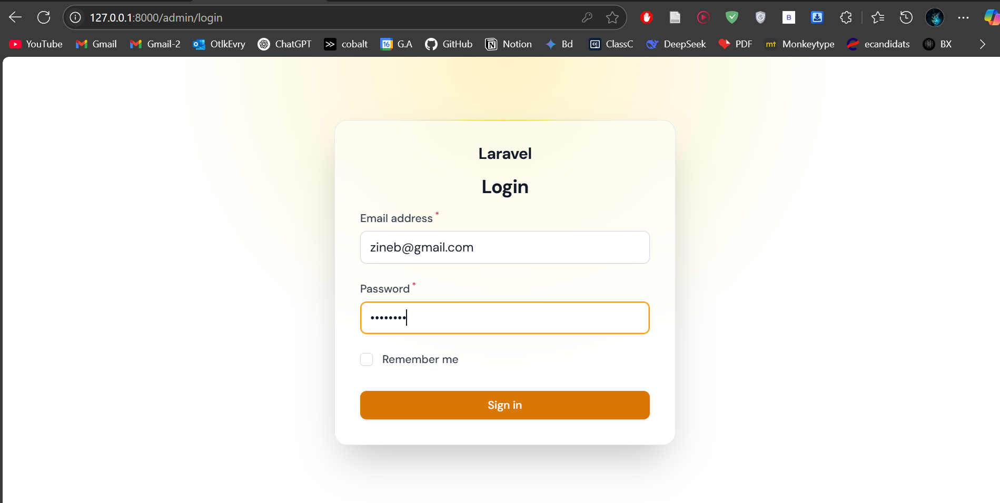

# Real Estate Booking Admin Panel :

This project is a Laravel-based web application for managing real estate properties and bookings. It features an admin login system, property management (create, list, delete), and booking management (create, list, delete).

---

## Admin Login :

The admin must log in to access the dashboard.


---

## Property List

After login, the admin can view a list of all properties in the system.

---

## Add a Property

Admins can add new properties using a form.

---

## Delete a Property

Each property can be individually deleted from the list.

---

## Booking List

Admins can view all bookings linked to properties.

---

## Add a Booking

Admins can create a booking by selecting a user, a property, and the booking dates.

---

## Delete a Booking

Admins can also delete existing bookings.

---

## Technologies Used

-   Laravel 9
-   PHP 8
-   MySQL
-   Blade (template engine)
-   Bootstrap (or another CSS framework)
-   Laravel Breeze / Laravel UI (if used for auth)

---

## Installation

```bash
git clone https://github.com/your-repo/real-estate-admin.git
cd real-estate-admin
composer install
cp .env.example .env
php artisan key:generate
```
